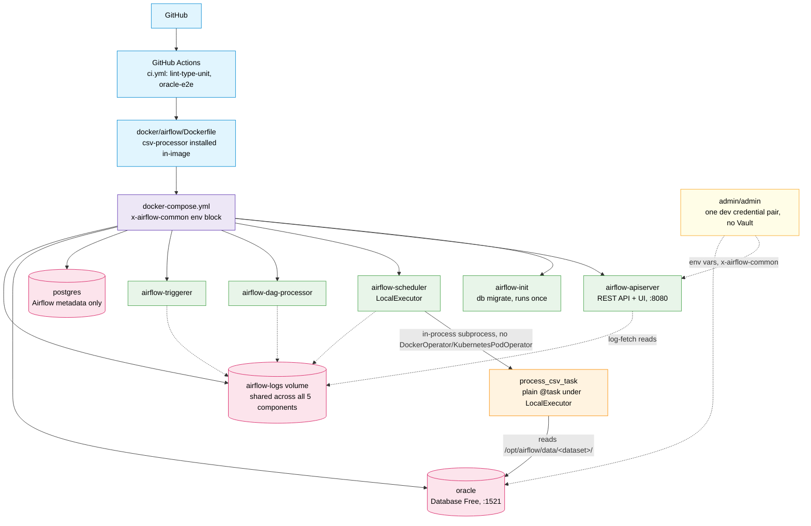
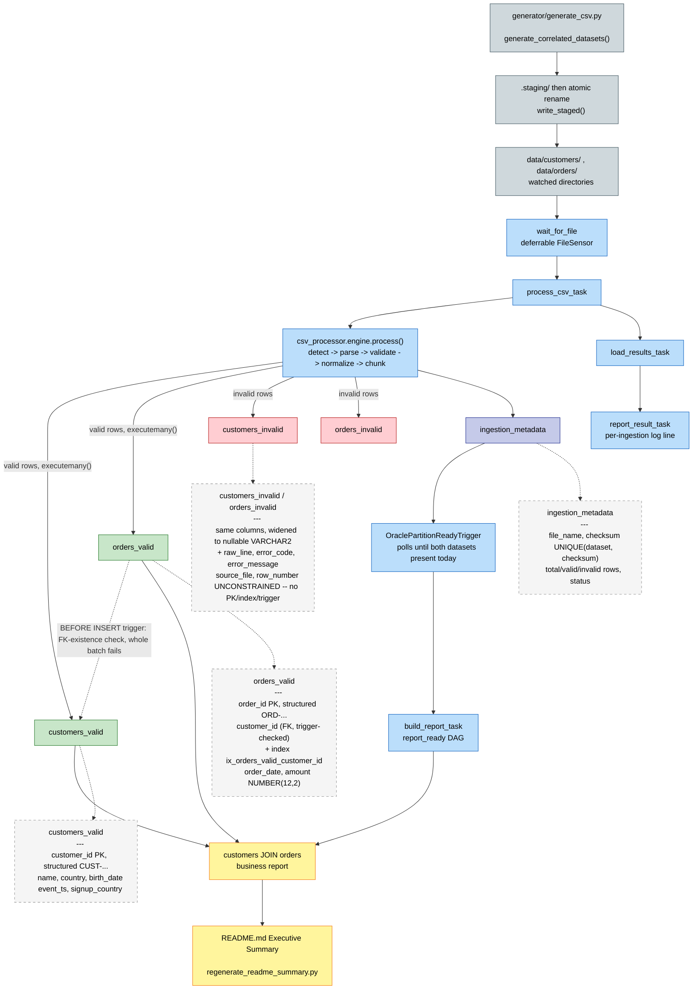

<!-- EXEC-SUMMARY:START -->

# Executive Summary

Live evidence of a working HTTP-trigger -> Airflow DAG -> Oracle ETL pipeline
(TEST-03/DOC-01), regenerated automatically after every push to `master`
(D-11/D-12) by `scripts/regenerate_readme_summary.py`, landed via a PR
`.github/workflows/readme-summary.yml` opens and auto-merges once
`lint-type-unit`/`oracle-e2e` genuinely pass against it (D-13). Last
regenerated: `2026-08-30T13:56:51.227556+00:00`.

### Latest ingestion per dataset

| Dataset | File Name | Total Rows | Valid Rows | Invalid Rows | Status | Processed At (UTC) |
|---|---|---|---|---|---|---|
| customers | customers_20260830.csv | 15 | 12 | 3 | SUCCESS_WITH_INVALID_ROWS | 2026-08-30T13:56:36.235100 |
| orders | orders_20260830.csv | 250 | 200 | 50 | SUCCESS_WITH_INVALID_ROWS | 2026-08-30T13:56:48.159231 |

### Deferred-wake proof

`wait_for_file` reported Airflow task state `deferred` for the `customers` dataset (`dag_run_id=manual__2026-08-30T13:56:22.662041+00:00`) at `2026-08-30T13:56:31.897042+00:00` -- confirmed BEFORE the fixture file existed on disk, proving the non-blocking file-wait genuinely deferred rather than short-circuited against an already-present file.

### Customers x Orders business report (top 10)

Region is `customers.country` (no literal `region` column exists in this
schema -- explicit substitution, not silently assumed, D-10). Grouped by
region and month-of-`orders.order_date`; see `scripts/verify_evidence.sql`
for the full, un-truncated report and `make verify-evidence` to reproduce it.

| Region | Order Month | Order Count | Total Amount | Avg Amount |
|---|---|---|---|---|
| Armenia | 2026-02 | 3 | 16504.95 | 5501.65 |
| Azerbaijan | 2026-01 | 27 | 135569.92 | 5021.11 |
| Azerbaijan | 2026-02 | 45 | 226814.04 | 5040.31 |
| Azerbaijan | 2026-03 | 1 | 1030.64 | 1030.64 |
| Benin | 2026-01 | 2 | 11971.01 | 5985.51 |
| Benin | 2026-02 | 4 | 20284.21 | 5071.05 |
| Benin | 2026-03 | 1 | 4620.51 | 4620.51 |
| Lesotho | 2026-01 | 12 | 67065.44 | 5588.79 |
| Lesotho | 2026-02 | 11 | 53172.53 | 4833.87 |
| Malaysia | 2026-01 | 7 | 23874.9 | 3410.7 |

<!-- EXEC-SUMMARY:END -->

# Lightweight Airflow CSV→Oracle ETL Platform

A small, local Airflow environment that detects, parses, validates, and bulk-loads generated CSV
files into Oracle Database Free, orchestrated by a thin Airflow TaskFlow DAG that delegates all
parsing/validation/loading logic to a reusable, Airflow-agnostic Python CSV processing engine. It
is the deliberately-small sibling of an existing production-shaped Airflow platform — see
`.planning/PROJECT.md` for the full project context, requirements, and scope.

This README is a short summary with links into the topic docs below — the actual command
sequences live in `docs/*.md`, never duplicated here.

## Platform / Environment Architecture

<details open>
<summary><strong>Click to collapse</strong></summary>



### Data Flow Legend
- **(blue) CI/CD**: GitHub, GitHub Actions, and the Airflow image it builds
- **(purple) docker-compose**: the single `x-airflow-common` environment block every Airflow service shares (credentials, secret keys, the shared logs volume)
- **(green) Airflow**: the 5 required components (init, apiserver, scheduler, dag-processor, triggerer) — `LocalExecutor` only, no Celery/Kubernetes
- **(orange) Compute**: `process_csv_task`, a plain `@task` OS subprocess — never a separate container
- **(pink) Storage**: Postgres (Airflow metadata only), Oracle (all business data), and the shared `airflow-logs` volume
- **(yellow) Credentials**: one `admin`/`admin` pair via env vars — no secrets manager
- **Solid Lines**: CI build flow, compose fan-out, and the task's Oracle write path
- **Dotted Lines**: shared-volume log access and credential distribution

### Key Relationships
- `LocalExecutor` runs each task as an OS subprocess forked from the scheduler — `csv-processor` is installed directly into the shared Airflow image (`Dockerfile`), so `process_csv_task` pays only import + function-call cost, never a per-task container
- Airflow's metadata (Postgres) and business data (Oracle) are two separate, physically distinct database engines — never mixed
- All 5 Airflow components mount the *same* `airflow-logs` volume, so a task's logs stay fetchable regardless of which container originally produced them — a container recreate no longer orphans historical logs
- One `admin`/`admin` credential pair, sourced from env vars in `x-airflow-common`, authenticates both Oracle and Airflow's own REST API/UI

</details>

## Data Pipeline / Data Layers Architecture

<details open>
<summary><strong>Click to collapse</strong></summary>



### Data Flow Legend
- **(blue-grey) Generation**: `generator/generate_csv.py` produces Zipf-correlated `customers`/`orders` CSVs, staged then atomically renamed into the watched directory
- **(blue) Airflow Tasks**: the `csv_ingest` DAG's chain (`wait_for_file` → `process_csv_task` → `load_results_task` → `report_result_task`) plus the `report_ready` DAG's sensor/report task
- **(green) Valid**: `customers_valid`/`orders_valid` — PK + index + FK-existence trigger enforced
- **(red) Invalid**: `customers_invalid`/`orders_invalid` — fully unconstrained, widened nullable columns
- **(indigo) Metadata**: `ingestion_metadata`, the checksum-keyed idempotency record every ingestion writes
- **(yellow) Reporting**: the customers ⋈ orders business report, live-regenerated into README.md's Executive Summary
- **Solid Lines**: file/row movement through the pipeline
- **Dotted Lines**: the FK-existence trigger check, and table-schema/constraint detail annotations

### Key Relationships
- `orders_valid.customer_id` is drawn from the *same* pool of `customer_id` values that land in `customers_valid` (Zipf-weighted, with replacement) — never independently random — which is what makes the customers ⋈ orders JOIN return real rows
- The `BEFORE INSERT` trigger on `orders_valid` is a DB-level safety net on top of the Python-side correlation, not a replacement for it — it rejects the *whole batch* if a `customer_id` doesn't already exist in `customers_valid`
- `customers_invalid`/`orders_invalid` are reachable only via the same `engine.process()` call, never a separate write path — and carry zero constraints, by design
- The business report is materialized three independent ways from the identical, never-re-authored SQL: an ad hoc `make verify-evidence` run, the CI-triggered README regeneration, and the live `report_ready` DAG

</details>

## Getting Started

Prerequisites: Docker Desktop (with WSL2 integration enabled), GNU Make.

```bash
git clone <this-repo-url>
cd lightweight-airflow-etl
cp .env.example .env

# One-time: recreate the gitignored Airflow auth passwords file (no automated
# mechanism exists for this yet — see docs/environment.md "First-Clone Setup Gaps")
mkdir -p docker/airflow
echo '{"admin": "admin"}' > docker/airflow/simple_auth_manager_passwords.json.generated

make up
```

This brings up the full stack (Airflow LocalExecutor + its metadata DB + Oracle Database Free).
Airflow's UI/API is at `http://localhost:8080` (`admin`/`admin`); Oracle is reachable at
`localhost:1521/FREEPDB1` (`admin`/`admin`).

For CPU/RAM/disk requirements, `.wslconfig` sizing, networking caveats, and first-boot
troubleshooting (including a known permission gotcha on first boot), see
**[docs/environment.md](docs/environment.md)**.

Once the stack is up, trigger a real HTTP-triggered ingestion end to end:

```bash
uv run python generator/generate_csv.py --dataset customers
scripts/trigger_dag.sh customers configs/datasets/customers.json
make verify-evidence
```

See **[docs/airflow-dag.md](docs/airflow-dag.md)** for the exact triggering/polling flow and
live-verification evidence of this working. This is intentionally the full clone-to-first-ingest
path in one place — the linked docs below cover every deeper detail (architecture, config
contract, engine internals, Oracle schema, local dev workflow) without repeating the same
commands twice.

## Documentation

| Doc | Covers |
|---|---|
| [docs/environment.md](docs/environment.md) | CPU/RAM/disk sizing, `.wslconfig`, networking caveats, first-boot troubleshooting |
| [docs/architecture.md](docs/architecture.md) | The full HTTP→DAG→engine→Oracle path, the `airflow/dags/` vs. `packages/csv-processor/` boundary, the two-tier reference-repo reuse decision, and the `docker-compose.yml` topology |
| [docs/configuration.md](docs/configuration.md) | The `config.json` contract shape, `defaults.json` merge semantics, and the two real dataset configs |
| [docs/csv-engine.md](docs/csv-engine.md) | The detect→parse→validate→normalize→chunk sequence, the 7 closed `Status` values, and the bounded-memory chunking guarantee |
| [docs/oracle.md](docs/oracle.md) | The 5-table schema, `_invalid` column widening, `INTERVAL` partitioning, `executemany()` bulk loading, checksum-based idempotency, the business report, and its DB-level PK/index/trigger correlation safety net |
| [docs/airflow-dag.md](docs/airflow-dag.md) | Both DAGs' task graphs (`csv_ingest` and the report-sensing `report_ready`), how to trigger them, and live-verification evidence |
| [docs/development.md](docs/development.md) | Local dev workflow (tests, reset, fixtures, lint/type-check), code layout, adding a new dataset, and CI/troubleshooting |
| [docs/benchmark.md](docs/benchmark.md) | The naive-vs-bulk Oracle write comparison at ~100K rows, with per-chunk timing |

## Notes & Q&A

### Q: To run Python operators on a different executor than Airflow's own scheduler/executor, do we have to use DockerOperator, or is there another architecture approach?

There are a few standard patterns, from heaviest to lightest isolation:

1. **`KubernetesPodOperator`** — each task run gets its own pod, fully separate container. Used by the sibling reference project (`airflow-platform`). Explicitly out of scope here — no Kubernetes at all in this project.
2. **`DockerOperator`** — each task run gets its own Docker container, spun up by the scheduler/worker via the Docker socket (needs the Airflow container to have Docker-in-Docker or docker-socket-mount access). Same idea as K8s but simpler infra, still a distinct container per task.
3. **`ExternalPythonOperator`** (`@task.external_python`) — runs the callable using a *different, pre-existing* Python interpreter/venv on the same machine/container. No new container, just a different `python` binary path. Lighter than Docker, still gives dependency isolation.
4. **`PythonVirtualenvOperator`** (`@task.virtualenv`) — builds an ephemeral venv on the fly per task run (pip-installs whatever deps you declare), then tears it down. Same host, no persistent isolation.
5. **Plain `@task` / `PythonOperator` under `LocalExecutor`** — what this project actually does. `LocalExecutor` already runs each task as a separate OS subprocess forked from the scheduler, so you get process-level isolation (a crash in one task doesn't kill the scheduler), but it's still the same container, same Python environment, same installed packages as Airflow itself.

This project deliberately picked option 5 — `CLAUDE.md` explicitly says `process_csv` "runs in-process under Airflow's LocalExecutor instead" of `KubernetesPodOperator`, and Kubernetes is called out as out of scope. That's why Plan 01-03 builds a custom Airflow image with `csv-processor` installed directly into Airflow's own environment, rather than reaching for `DockerOperator`/K8s — it keeps the "lightweight" framing: no docker-socket access needed from inside Airflow, no per-task container overhead, just a Python function call. If you ever wanted a middle ground without going full-Docker/K8s, `ExternalPythonOperator` would be the next lightest option — but it's not part of the current plan.

### Q: Would switching to `PythonVirtualenvOperator` (`@task.virtualenv`) from plain `@task`/`PythonOperator` under `LocalExecutor` result in very slow file processing due to ephemeral venvs?

Yes, almost certainly — and that's exactly why this project doesn't use it.

**Where the slowdown comes from:**
1. **Venv creation**: `PythonVirtualenvOperator` builds a fresh virtualenv via `virtualenv`/`venv` and `pip install`s its `requirements` list on every task execution (unless you opt into the `venv_cache_path` caching feature added in newer Airflow versions, which reuses a venv keyed by a hash of the requirements — but even then, the *first* run per cache-key still pays full cost, and cache misses happen anytime requirements/versions drift).
2. **Subprocess spawn + interpreter startup**: even with a cached venv, each call still forks a brand-new Python process pointing at a different interpreter — slower than calling a function already loaded in the running process, but this part is comparatively cheap (milliseconds to ~1s).
3. **Serialization boundary**: arguments and return values cross the process boundary via pickling to/from a temp file, which adds overhead proportional to what you pass — not usually a big deal here if you're just passing file paths/config, not whole dataframes.

For CSV ingestion specifically, cost #1 dominates. If this pipeline processes files frequently (one task per file, or a scheduled DAG run per batch), you'd pay venv-build/pip-install latency on a large fraction of task executions — easily seconds to tens of seconds each, dwarfing the actual CSV parse/validate/load work for small-to-medium files.

Compare that to the plain `@task`/`LocalExecutor` approach this project uses: `csv-processor` is already installed into the Airflow image's own environment (Plan 01-03), so calling `process_csv` pays only normal Python import + function-call cost — no venv build, no pip install, no extra interpreter spin-up beyond what `LocalExecutor` already does per task.

So this is a real, deliberate trade-off in the architecture, not just a "keep it simple" preference: `PythonVirtualenvOperator` would work, but it would meaningfully hurt throughput on a per-file (or per-batch) ingestion workload — which is why `CLAUDE.md`'s in-process/`LocalExecutor` decision is the right one for this project's actual access pattern.
