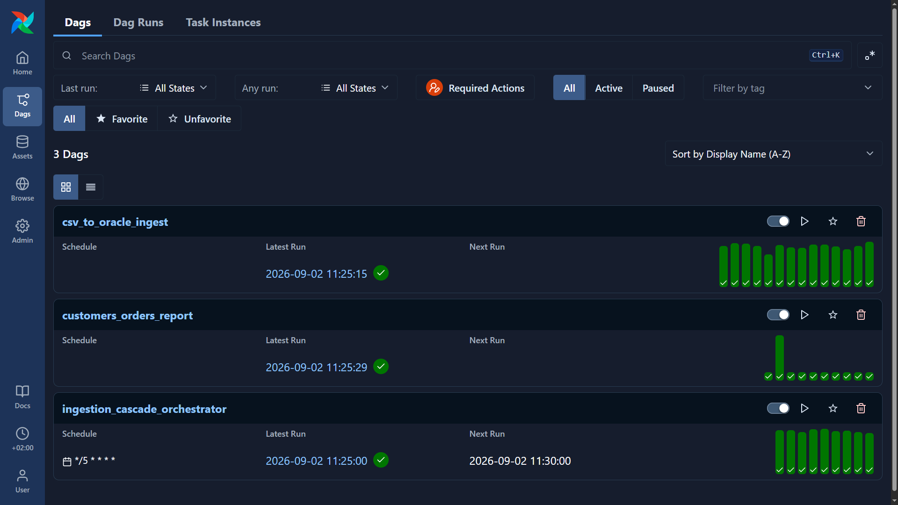
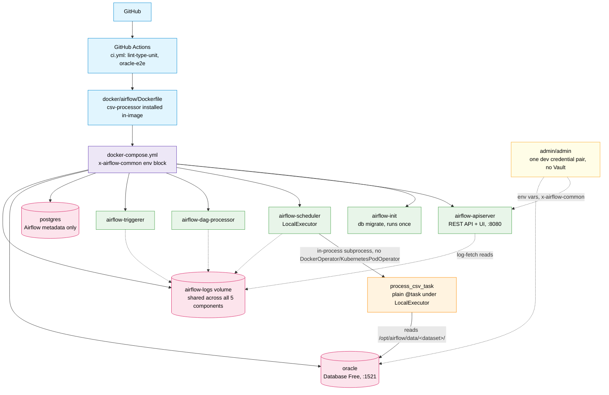
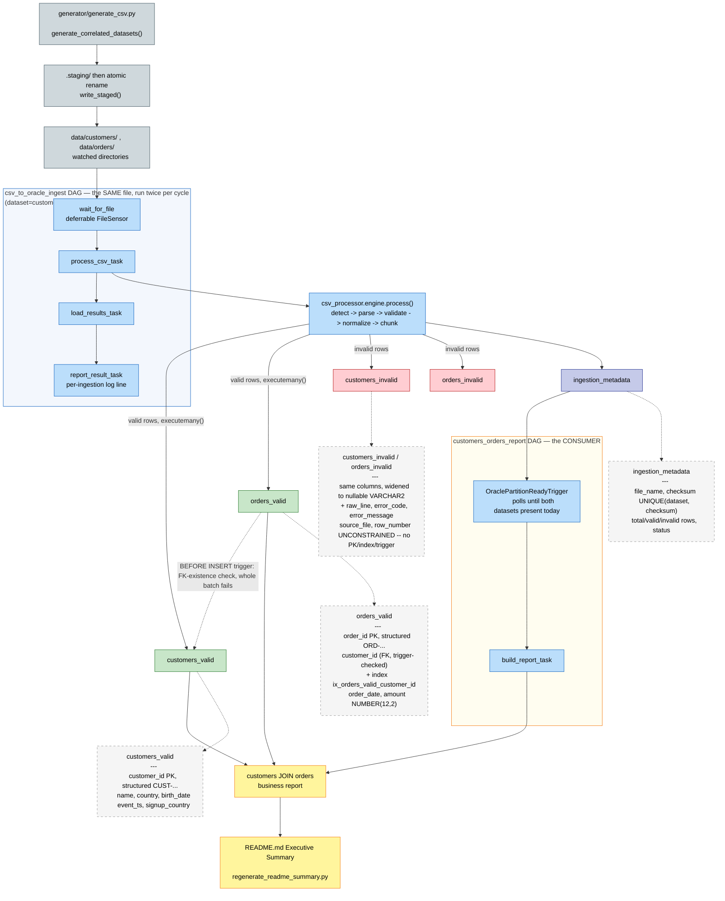
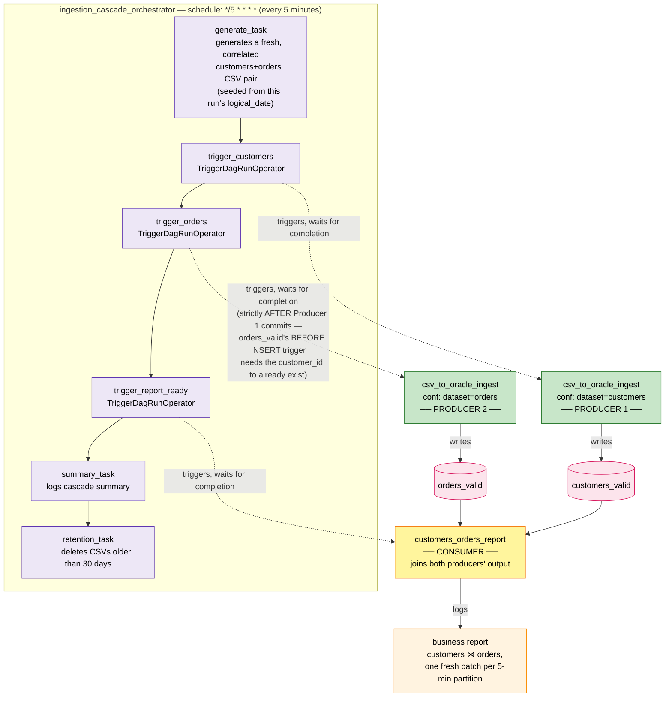

<!-- EXEC-SUMMARY:START -->

# Executive Summary

Live evidence of a working HTTP-trigger -> Airflow DAG -> Oracle ETL pipeline
(TEST-03/DOC-01), regenerated automatically after every push to `master`
(D-11/D-12) by `scripts/regenerate_readme_summary.py`, landed via a PR
`.github/workflows/readme-summary.yml` opens and auto-merges once
`lint-type-unit`/`oracle-e2e` genuinely pass against it (D-13). Last
regenerated: `2026-09-02T09:28:55.512332+00:00`.


*Airflow's Dags view, live: all three DAGs active and green — `ingestion_cascade_orchestrator`
running on its `*/5 * * * *` schedule, fanning out into `csv_to_oracle_ingest` (the producer,
triggered once per dataset) and `customers_orders_report` (the consumer, joining both).*

### Latest ingestion per dataset

| Dataset | File Name | Total Rows | Valid Rows | Invalid Rows | Status | Processed At (UTC) |
|---|---|---|---|---|---|---|
| customers | customers_20260902.csv | 15 | 12 | 3 | SUCCESS_WITH_INVALID_ROWS | 2026-09-02T09:28:39.941572 |
| orders | orders_20260902.csv | 250 | 200 | 50 | SUCCESS_WITH_INVALID_ROWS | 2026-09-02T09:28:52.306343 |

### Deferred-wake proof

`wait_for_file` reported Airflow task state `deferred` for the `customers` dataset (`dag_run_id=manual__2026-09-02T09:28:32.150485+00:00`) at `2026-09-02T09:28:36.242394+00:00` -- confirmed BEFORE the fixture file existed on disk, proving the non-blocking file-wait genuinely deferred rather than short-circuited against an already-present file.

### Customers x Orders business report (top 10)

Region is `customers.country` (no literal `region` column exists in this
schema -- explicit substitution, not silently assumed, D-10). Grouped by
region and month-of-`orders.order_date`; see `scripts/verify_evidence.sql`
for the full, un-truncated report and `make verify-evidence` to reproduce it.

| Region | Order Month | Order Count | Total Amount | Avg Amount |
|---|---|---|---|---|
| Afghanistan | 2026-02 | 1 | 6568.28 | 6568.28 |
| Albania | 2026-01 | 1 | 2808.15 | 2808.15 |
| Algeria | 2026-01 | 2 | 13687.11 | 6843.56 |
| Algeria | 2026-02 | 4 | 8977.56 | 2244.39 |
| American Samoa | 2026-01 | 4 | 14973.17 | 3743.29 |
| American Samoa | 2026-02 | 4 | 9019.86 | 2254.97 |
| Andorra | 2026-01 | 2 | 10018.58 | 5009.29 |
| Andorra | 2026-02 | 3 | 7939.26 | 2646.42 |
| Angola | 2026-01 | 1 | 2340.69 | 2340.69 |
| Angola | 2026-02 | 1 | 3355.62 | 3355.62 |

<!-- EXEC-SUMMARY:END -->

# Lightweight Airflow CSV→Oracle ETL Platform

A small, local Airflow environment that detects, parses, validates, and bulk-loads generated CSV
files into Oracle Database Free, orchestrated by a thin Airflow TaskFlow DAG that delegates all
parsing/validation/loading logic to a reusable, Airflow-agnostic Python CSV processing engine. It
is the deliberately-small sibling of an existing production-shaped Airflow platform — see
`.planning/PROJECT.md` for the full project context, requirements, and scope.

This README is a short summary with links into the topic docs below — the actual command
sequences live in `docs/*.md`, never duplicated here.

## Platform / Environment Architecture

<details open>
<summary><strong>Click to collapse</strong></summary>



### Data Flow Legend
- **(blue) CI/CD**: GitHub, GitHub Actions, and the Airflow image it builds
- **(purple) docker-compose**: the single `x-airflow-common` environment block every Airflow service shares (credentials, secret keys, the shared logs volume)
- **(green) Airflow**: the 5 required components (init, apiserver, scheduler, dag-processor, triggerer) — `LocalExecutor` only, no Celery/Kubernetes
- **(orange) Compute**: `process_csv_task`, a plain `@task` OS subprocess — never a separate container
- **(pink) Storage**: Postgres (Airflow metadata only), Oracle (all business data), and the shared `airflow-logs` volume
- **(yellow) Credentials**: one `admin`/`admin` pair via env vars — no secrets manager
- **Solid Lines**: CI build flow, compose fan-out, and the task's Oracle write path
- **Dotted Lines**: shared-volume log access and credential distribution

### Key Relationships
- `LocalExecutor` runs each task as an OS subprocess forked from the scheduler — `csv-processor` is installed directly into the shared Airflow image (`Dockerfile`), so `process_csv_task` pays only import + function-call cost, never a per-task container
- Airflow's metadata (Postgres) and business data (Oracle) are two separate, physically distinct database engines — never mixed
- All 5 Airflow components mount the *same* `airflow-logs` volume, so a task's logs stay fetchable regardless of which container originally produced them — a container recreate no longer orphans historical logs
- One `admin`/`admin` credential pair, sourced from env vars in `x-airflow-common`, authenticates both Oracle and Airflow's own REST API/UI

</details>

## Data Pipeline / Data Layers Architecture

<details open>
<summary><strong>Click to collapse</strong></summary>



### Data Flow Legend
- **(blue-grey) Generation**: `generator/generate_csv.py` produces Zipf-correlated `customers`/`orders` CSVs, staged then atomically renamed into the watched directory
- **(blue box) `csv_to_oracle_ingest` DAG**: `wait_for_file` → `process_csv_task` → `load_results_task` → `report_result_task` — this exact box runs twice per cycle, once per dataset (see "DAG Orchestration: Producers & Consumer" above)
- **(yellow box) `customers_orders_report` DAG**: `wait_for_both_datasets` (the `OraclePartitionReadyTrigger` sensor) → `build_report_task` — the consumer that joins both producers' output
- **(green) Valid**: `customers_valid`/`orders_valid` — PK + index + FK-existence trigger enforced
- **(red) Invalid**: `customers_invalid`/`orders_invalid` — fully unconstrained, widened nullable columns
- **(indigo) Metadata**: `ingestion_metadata`, the checksum-keyed idempotency record every ingestion writes
- **(yellow) Reporting**: the customers ⋈ orders business report, live-regenerated into README.md's Executive Summary
- **Solid Lines**: file/row movement through the pipeline
- **Dotted Lines**: the FK-existence trigger check, and table-schema/constraint detail annotations

### Key Relationships
- `orders_valid.customer_id` is drawn from the *same* pool of `customer_id` values that land in `customers_valid` (Zipf-weighted, with replacement) — never independently random — which is what makes the customers ⋈ orders JOIN return real rows
- The `BEFORE INSERT` trigger on `orders_valid` is a DB-level safety net on top of the Python-side correlation, not a replacement for it — it rejects the *whole batch* if a `customer_id` doesn't already exist in `customers_valid`
- `customers_invalid`/`orders_invalid` are reachable only via the same `engine.process()` call, never a separate write path — and carry zero constraints, by design
- The business report is materialized three independent ways from the identical, never-re-authored SQL: an ad hoc `make verify-evidence` run, the CI-triggered README regeneration, and the live `customers_orders_report` DAG

</details>

## DAG Orchestration: Producers & Consumer

`csv_to_oracle_ingest` is **one** DAG, not two — the same, unmodified DAG file runs twice per cycle,
parameterized purely by the runtime `conf` it's triggered with (`dataset: "customers"` vs.
`dataset: "orders"`). Every 5 minutes, `ingestion_cascade_orchestrator` generates a fresh,
correlated CSV pair and runs both as sequential **producers**, then triggers
`customers_orders_report` — the **consumer** — which joins whatever both producers just wrote.

<details open>
<summary><strong>Click to collapse</strong></summary>



### Data Flow Legend
- **(purple) Orchestrator**: `ingestion_cascade_orchestrator`'s own task chain — the only DAG on a real cron schedule (`*/5 * * * *`); everything else runs on demand, triggered by it
- **(green) Producers**: two runs of the *same* `csv_to_oracle_ingest` DAG file, distinguished only by runtime `conf` — never two separate DAGs, never dataset-specific code
- **(yellow) Consumer**: `customers_orders_report` — waits (via `OraclePartitionReadyTrigger`) until both producers have written today's partition, then joins them
- **(pink) Storage**: `customers_valid`/`orders_valid`, written by each producer independently
- **Solid Lines**: same-DAG task-to-task dependency (`ORCH` subgraph) and row/data movement
- **Dotted Lines**: cross-DAG `TriggerDagRunOperator` calls — a *different* DagRun is started and waited on, not a task within the same DAG

### Key Relationships
- `trigger_customers` and `trigger_orders` call the exact same DAG (`trigger_dag_id="csv_to_oracle_ingest"`) with different `conf` — there is no `csv_ingest_customers`/`csv_ingest_orders` DAG pair, by design (DAG-05)
- `trigger_orders` is ordered strictly **after** `trigger_customers` fully commits, not run in parallel — Producer 2's rows would otherwise race Producer 1's `customers_valid` writes, which the DB-level `BEFORE INSERT` FK trigger on `orders_valid` would then reject
- The consumer never re-derives which rows are "new" from this specific cycle — it re-runs the *same* full `customers_valid ⋈ orders_valid` business-report SQL every time (see `docs/oracle.md`'s "Business Report Evidence"); "per-partition" framing in this document refers to *when* each producer's rows were `ingested_at`, not a column the report itself filters on

</details>

## Example: Business Report Output Per 5-Minute Partition

Live snapshot from the running stack — the customers ⋈ orders JOIN, bucketed by each producer
pair's 5-minute `ingested_at` window (`TRUNC(ingested_at,'HH24') + FLOOR(MI/5)*5/1440`), 3 rows per
partition. Reproduce this yourself with the ready-to-paste query in "Querying Oracle Directly"
below.

| Partition (UTC) | Customer ID | Country | Order ID | Order Date | Amount |
|---|---|---|---|---|---|
| 2026-09-02 09:00 | CUST-e5689bfb-000001 | Papua New Guinea | ORD-e5689bfb-000001 | 2026-02-03 | 1128.75 |
| 2026-09-02 09:00 | CUST-e5689bfb-000009 | Ghana | ORD-e5689bfb-000002 | 2026-01-25 | 4901.05 |
| 2026-09-02 09:00 | CUST-e5689bfb-000002 | French Southern Territories | ORD-e5689bfb-000003 | 2026-01-24 | 536.43 |
| 2026-09-02 09:05 | CUST-99d949e5-000029 | Cocos (Keeling) Islands | ORD-99d949e5-000001 | 2026-01-21 | 1526.18 |
| 2026-09-02 09:05 | CUST-99d949e5-000028 | Sierra Leone | ORD-99d949e5-000002 | 2026-01-07 | 6931.68 |
| 2026-09-02 09:05 | CUST-99d949e5-000009 | Iraq | ORD-99d949e5-000003 | 2026-01-26 | 8951.75 |
| 2026-09-02 09:10 | CUST-2dbf35e0-000004 | Slovenia | ORD-2dbf35e0-000001 | 2026-02-21 | 7460.56 |
| 2026-09-02 09:10 | CUST-2dbf35e0-000001 | Madagascar | ORD-2dbf35e0-000002 | 2026-01-24 | 541.97 |
| 2026-09-02 09:10 | CUST-2dbf35e0-000027 | Burkina Faso | ORD-2dbf35e0-000003 | 2026-01-14 | 6391.93 |

Every one of these partitions matched **90 orders** (`rows=100`, `invalid_ratio=0.1` default Params
→ ~90 valid rows per producer per cycle), and the `customer_id`/`order_id` prefixes are unique per
partition (derived from `derive_seed(logical_date)`) — confirming each 5-minute cycle really does
generate and ingest fresh, non-duplicate, correctly-correlated data rather than replaying the same
batch.

## Getting Started

Prerequisites: Docker Desktop (with WSL2 integration enabled), GNU Make.

```bash
git clone <this-repo-url>
cd lightweight-airflow-etl
cp .env.example .env

# One-time: recreate the gitignored Airflow auth passwords file (no automated
# mechanism exists for this yet — see docs/environment.md "First-Clone Setup Gaps")
mkdir -p docker/airflow
echo '{"admin": "admin"}' > docker/airflow/simple_auth_manager_passwords.json.generated

make up
```

This brings up the full stack (Airflow LocalExecutor + its metadata DB + Oracle Database Free).
Airflow's UI/API is at `http://localhost:8080` (`admin`/`admin`); Oracle is reachable at
`localhost:1521/FREEPDB1` (`admin`/`admin`).

For CPU/RAM/disk requirements, `.wslconfig` sizing, networking caveats, and first-boot
troubleshooting (including a known permission gotcha on first boot), see
**[docs/environment.md](docs/environment.md)**.

Once the stack is up, trigger a real HTTP-triggered ingestion end to end:

```bash
uv run python generator/generate_csv.py --dataset customers
scripts/trigger_dag.sh customers configs/datasets/customers.json
make verify-evidence
```

See **[docs/airflow-dag.md](docs/airflow-dag.md)** for the exact triggering/polling flow and
live-verification evidence of this working. This is intentionally the full clone-to-first-ingest
path in one place — the linked docs below cover every deeper detail (architecture, config
contract, engine internals, Oracle schema, local dev workflow) without repeating the same
commands twice.

## Querying Oracle Directly

With the stack up (`make up`), connect to Oracle from your host via `sqlplus` inside the
running container — no local Oracle client install needed:

```bash
docker compose exec oracle sqlplus admin/admin@//localhost:1521/FREEPDB1
```

This drops you into an interactive `SQL>` prompt (`exit` or `quit` to leave). From there:

```sql
-- List every table in the schema
SELECT table_name FROM user_tables ORDER BY table_name;

-- Inspect a table's columns
DESCRIBE customers_valid;

-- Row counts across the pipeline's tables
SELECT 'customers_valid' AS table_name, COUNT(*) AS row_count FROM customers_valid
UNION ALL SELECT 'customers_invalid', COUNT(*) FROM customers_invalid
UNION ALL SELECT 'orders_valid', COUNT(*) FROM orders_valid
UNION ALL SELECT 'orders_invalid', COUNT(*) FROM orders_invalid
UNION ALL SELECT 'ingestion_metadata', COUNT(*) FROM ingestion_metadata;

-- The customers ⋈ orders business report itself (see scripts/verify_evidence.sql
-- for the full, canonical version of this query)
SELECT c.country AS region, TRUNC(o.order_date, 'MM') AS order_month,
       COUNT(*) AS order_count, SUM(o.amount) AS total_amount, ROUND(AVG(o.amount), 2) AS avg_amount
FROM customers_valid c JOIN orders_valid o ON o.customer_id = c.customer_id
GROUP BY c.country, TRUNC(o.order_date, 'MM')
ORDER BY region, order_month;

-- The SAME join, instead bucketed by each producer pair's 5-minute ingested_at
-- window -- reproduces the "Example: Business Report Output Per 5-Minute
-- Partition" table above, 3 rows per partition
WITH joined AS (
  SELECT
    TRUNC(o.ingested_at, 'HH24')
      + FLOOR(TO_NUMBER(TO_CHAR(o.ingested_at, 'MI')) / 5) * 5 / 1440 AS run_bucket,
    c.customer_id, c.country, o.order_id, o.order_date, o.amount
  FROM customers_valid c JOIN orders_valid o ON o.customer_id = c.customer_id
),
ranked AS (
  SELECT j.*, ROW_NUMBER() OVER (PARTITION BY run_bucket ORDER BY order_id) AS rn
  FROM joined j
)
SELECT TO_CHAR(run_bucket, 'YYYY-MM-DD HH24:MI') AS partition_utc,
       customer_id, country, order_id, order_date, amount
FROM ranked
WHERE rn <= 3
ORDER BY run_bucket, order_id;
```

For one-shot, non-interactive queries (e.g. from a script), pipe SQL in via stdin instead —
this is exactly what `make verify-evidence` and CI do under the hood:

```bash
docker compose exec -T oracle sqlplus -s admin/admin@//localhost:1521/FREEPDB1 <<'SQL'
SELECT table_name FROM user_tables ORDER BY table_name;
SQL
```

`-T` disables pseudo-TTY allocation (required when piping stdin non-interactively) and `-s`
runs `sqlplus` in silent mode (suppresses the banner/prompt clutter, output only). See
**[docs/oracle.md](docs/oracle.md)** for the full 5-table schema, the correlation
constraints (PK/index/trigger), partitioning, and idempotency details behind these tables.

## Documentation

| Doc | Covers |
|---|---|
| [docs/environment.md](docs/environment.md) | CPU/RAM/disk sizing, `.wslconfig`, networking caveats, first-boot troubleshooting |
| [docs/architecture.md](docs/architecture.md) | The full HTTP→DAG→engine→Oracle path, the `airflow/dags/` vs. `packages/csv-processor/` boundary, the two-tier reference-repo reuse decision, and the `docker-compose.yml` topology |
| [docs/configuration.md](docs/configuration.md) | The `config.json` contract shape, `defaults.json` merge semantics, and the two real dataset configs |
| [docs/csv-engine.md](docs/csv-engine.md) | The detect→parse→validate→normalize→chunk sequence, the 7 closed `Status` values, and the bounded-memory chunking guarantee |
| [docs/oracle.md](docs/oracle.md) | The 5-table schema, `_invalid` column widening, `INTERVAL` partitioning, `executemany()` bulk loading, checksum-based idempotency, the business report, and its DB-level PK/index/trigger correlation safety net |
| [docs/airflow-dag.md](docs/airflow-dag.md) | All three DAGs' task graphs (`csv_to_oracle_ingest`, the report-sensing `customers_orders_report`, and the `ingestion_cascade_orchestrator`), how to trigger them, and live-verification evidence |
| [docs/development.md](docs/development.md) | Local dev workflow (tests, reset, fixtures, lint/type-check), code layout, adding a new dataset, and CI/troubleshooting |
| [docs/benchmark.md](docs/benchmark.md) | The naive-vs-bulk Oracle write comparison at ~100K rows, with per-chunk timing |

## Notes & Q&A

### Q: To run Python operators on a different executor than Airflow's own scheduler/executor, do we have to use DockerOperator, or is there another architecture approach?

There are a few standard patterns, from heaviest to lightest isolation:

1. **`KubernetesPodOperator`** — each task run gets its own pod, fully separate container. Used by the sibling reference project (`airflow-platform`). Explicitly out of scope here — no Kubernetes at all in this project.
2. **`DockerOperator`** — each task run gets its own Docker container, spun up by the scheduler/worker via the Docker socket (needs the Airflow container to have Docker-in-Docker or docker-socket-mount access). Same idea as K8s but simpler infra, still a distinct container per task.
3. **`ExternalPythonOperator`** (`@task.external_python`) — runs the callable using a *different, pre-existing* Python interpreter/venv on the same machine/container. No new container, just a different `python` binary path. Lighter than Docker, still gives dependency isolation.
4. **`PythonVirtualenvOperator`** (`@task.virtualenv`) — builds an ephemeral venv on the fly per task run (pip-installs whatever deps you declare), then tears it down. Same host, no persistent isolation.
5. **Plain `@task` / `PythonOperator` under `LocalExecutor`** — what this project actually does. `LocalExecutor` already runs each task as a separate OS subprocess forked from the scheduler, so you get process-level isolation (a crash in one task doesn't kill the scheduler), but it's still the same container, same Python environment, same installed packages as Airflow itself.

This project deliberately picked option 5 — `CLAUDE.md` explicitly says `process_csv` "runs in-process under Airflow's LocalExecutor instead" of `KubernetesPodOperator`, and Kubernetes is called out as out of scope. That's why Plan 01-03 builds a custom Airflow image with `csv-processor` installed directly into Airflow's own environment, rather than reaching for `DockerOperator`/K8s — it keeps the "lightweight" framing: no docker-socket access needed from inside Airflow, no per-task container overhead, just a Python function call. If you ever wanted a middle ground without going full-Docker/K8s, `ExternalPythonOperator` would be the next lightest option — but it's not part of the current plan.

### Q: Would switching to `PythonVirtualenvOperator` (`@task.virtualenv`) from plain `@task`/`PythonOperator` under `LocalExecutor` result in very slow file processing due to ephemeral venvs?

Yes, almost certainly — and that's exactly why this project doesn't use it.

**Where the slowdown comes from:**
1. **Venv creation**: `PythonVirtualenvOperator` builds a fresh virtualenv via `virtualenv`/`venv` and `pip install`s its `requirements` list on every task execution (unless you opt into the `venv_cache_path` caching feature added in newer Airflow versions, which reuses a venv keyed by a hash of the requirements — but even then, the *first* run per cache-key still pays full cost, and cache misses happen anytime requirements/versions drift).
2. **Subprocess spawn + interpreter startup**: even with a cached venv, each call still forks a brand-new Python process pointing at a different interpreter — slower than calling a function already loaded in the running process, but this part is comparatively cheap (milliseconds to ~1s).
3. **Serialization boundary**: arguments and return values cross the process boundary via pickling to/from a temp file, which adds overhead proportional to what you pass — not usually a big deal here if you're just passing file paths/config, not whole dataframes.

For CSV ingestion specifically, cost #1 dominates. If this pipeline processes files frequently (one task per file, or a scheduled DAG run per batch), you'd pay venv-build/pip-install latency on a large fraction of task executions — easily seconds to tens of seconds each, dwarfing the actual CSV parse/validate/load work for small-to-medium files.

Compare that to the plain `@task`/`LocalExecutor` approach this project uses: `csv-processor` is already installed into the Airflow image's own environment (Plan 01-03), so calling `process_csv` pays only normal Python import + function-call cost — no venv build, no pip install, no extra interpreter spin-up beyond what `LocalExecutor` already does per task.

So this is a real, deliberate trade-off in the architecture, not just a "keep it simple" preference: `PythonVirtualenvOperator` would work, but it would meaningfully hurt throughput on a per-file (or per-batch) ingestion workload — which is why `CLAUDE.md`'s in-process/`LocalExecutor` decision is the right one for this project's actual access pattern.
